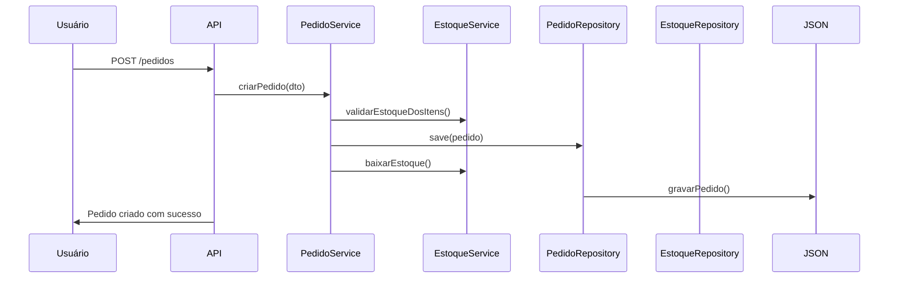
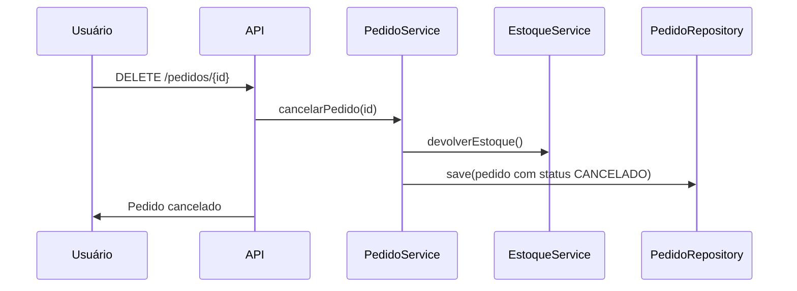

# 🏗️ ConstructEase

**ConstructEase** é um módulo de gerenciamento de **pedidos de materiais de construção**, desenvolvido em Java com Spring Boot. Ele permite que usuários efetuem pedidos de produtos como areia, cimento, argamassa, brita, bloco, tijolo e telhas, garantindo controle de estoque, integridade dos dados e persistência em arquivos JSON.

---

## 📦 Funcionalidades

- ✅ **Efetuar Pedido**  
  Criação de pedidos com validação de estoque e cálculo automático de valor total.

- ❌ **Cancelar Pedido**  
  Permite cancelar pedidos ativos, devolvendo os itens ao estoque.

- 📋 **Listar Pedidos Ativos**  
  Exibe apenas os pedidos com status `ATIVO`.

- 🔍 **Consultar Pedido por ID**  
  Retorna os dados completos de um pedido específico.

- 📊 **Listar Pedidos por Status**  
  Permite filtrar pedidos por status (`ATIVO`, `CANCELADO`, etc).

---

## 🧠 Regras de Negócio

- Não é possível efetuar pedidos de produtos inexistentes.
- Não é permitido solicitar quantidades superiores ao estoque disponível.
- Pedidos são persistidos em arquivos JSON, mantendo histórico.
- Operações críticas são atômicas e protegidas contra concorrência.
- Cada pedido contém: descrição, itens com quantidade e preço unitário.

---

## 🗂️ Estrutura do Projeto

```
constructease/
├── model/               # Entidades: Pedido, Produto, ItemPedido
├── dto/                 # DTOs para entrada e saída de dados
├── service/             # Regras de negócio
├── repository/          # Persistência em arquivos JSON
├── util/                # Utilitários: JSON, arredondamento
├── exception/           # Exceções personalizadas
├── resources/
│   └── application.properties
└── ConstructeaseApplication.java
```

---

## ⚙️ Instalação

```bash
git clone https://github.com/seu-usuario/constructease.git
cd constructease
./mvnw spring-boot:run
```

Acesse o H2 Console em: [http://localhost:8080/h2-console](http://localhost:8080/h2-console)  
Acesse a API em: [http://localhost:8080](http://localhost:8080)

---

## 🔄 Fluxo de Pedido



---

## ❌ Fluxo de Cancelamento



---

## 📬 Exemplos de Requisições

### 🔹 Cadastrar Produto no Estoque ou atualizar preço e quantidade.

```http
POST /estoque/cadastro
Content-Type: application/json

{
  "nome": "Cimento CP-II",
  "descricao": "Saco de cimento 50kg",
  "categoriaId": 1,
  "quantidade": 20,
  "preco": 25.50
}
```

### 🔹 Atualizar Nome de Produto

```http
PUT /estoque/11/nome
Content-Type: application/json

{
  "novoNome": "Lixa madeira"
}
```

### 🔹 Listar Produtos Disponíveis

```http
GET /estoque
```

### 🔹 Consultar Produto por ID

```http
GET /estoque/11
```

### 🔹 Criar Pedido

```http
POST /pedidos
Content-Type: application/json

{
  "descricao": "Pedido de cimento e areia",
  "itens": [
    { "produtoId": 1, "quantidade": 10 },
    { "produtoId": 2, "quantidade": 5 }
  ]
}
```

### 🔹 Cancelar Pedido

```http
DELETE /pedidos/1
```

### 🔹 Listar Todos os Pedidos

```http
GET /pedidos
```

### 🔹 Listar Pedidos por Status

```http
GET /pedidos?status=ATIVO
```


---

## 📁 Persistência

- Os dados são armazenados em arquivos JSON:
    - `data/estoque.json`
    - `data/pedidos.json`
- Utiliza `ObjectMapper` com suporte a `LocalDateTime` e indentação legível.

---

## 🧪 Testes

- Ambiente de testes configurado com `application-test.properties`
- Banco H2 em memória
- Possui testes unitários e de integração com JUnit

---

## 🚀 Tecnologias Utilizadas

- Java 17+
- Spring Boot
- Jakarta Validation
- Jackson
- SLF4J
- H2 Database (dev/test)
- JSON como base de dados

---

## 📌 Requisitos para rodar

```bash
# Requisitos
- Java 17+
- Maven

# Rodar aplicação
./mvnw spring-boot:run
```

---

## 👨‍💻 Autor

**Danilo** — Desenvolvedor e arquiteto do projeto  
Construindo soluções com visão de produto e engenharia de excelência. 🧱🚀

